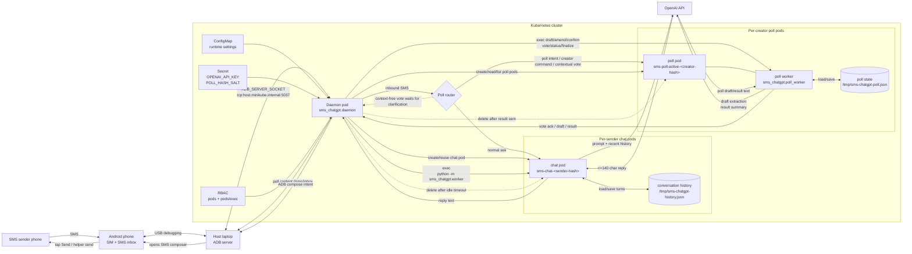
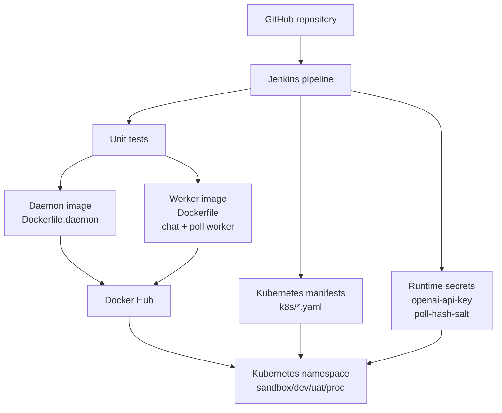

# SMS ChatGPT Architecture

## Runtime Flow

## Deployment Flow

## Key Runtime Notes

- The Android phone is physically attached to the host machine.
- In minikube, the pod connects to the host ADB server through `ADB_SERVER_SOCKET=tcp:host.minikube.internal:5037`.
- The daemon pod reads inbound SMS over ADB and opens the SMS composer for outbound replies unless a device-specific silent-send template is configured.
- Each sender maps to one Kubernetes chat pod, named from a sender hash.
- Conversation memory is stored inside that sender's chat pod and disappears when the pod is deleted after `CHAT_POD_IDLE_SECONDS`.
- When `POLL_ENABLED=true`, inbound SMS first passes through the poll router before falling back to the normal ChatGPT flow.
- A poll request containing words such as `poll`, `vote`, or `voting` creates a per-creator poll pod named from `POLL_POD_NAME` plus the creator MSISDN hash prefix.
- Each creator hash can have one pending or active poll. Other MSISDNs can still create their own polls and vote in polls created by others.
- Poll pods run the worker image and execute `python -m sms_chatgpt.poll_worker` for `draft`, `amend`, `confirm`, `vote`, `status`, and `finalize` actions.
- Poll state is stored inside the poll pod at `POLL_STATE_FILE`. It stores the creator hash, question, options, duration, expiry, and votes keyed by voter hash, not raw voter MSISDNs.
- The creator cannot vote in their own poll. Each voter hash can vote once per poll, and natural-language vote matching checks the vote text against the poll question context.
- Context-free vote-like SMS such as `yes`, `no`, `1`, or `maybe` are held in the daemon as pending votes. The sender must provide context before the matched poll expires, otherwise the pending vote is discarded.
- On each daemon loop, expired polls are finalized, anonymous aggregate counts are summarized through OpenAI, the result is sent only to the creator, and the poll pod is deleted after the send is acknowledged.
- The daemon needs RBAC permissions for pods and `pods/exec` so it can create chat and poll pods, inspect their status, execute workers inside them, patch metadata, and delete them.
