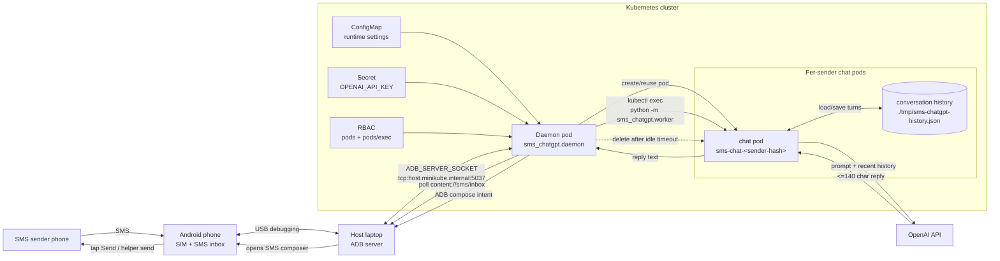
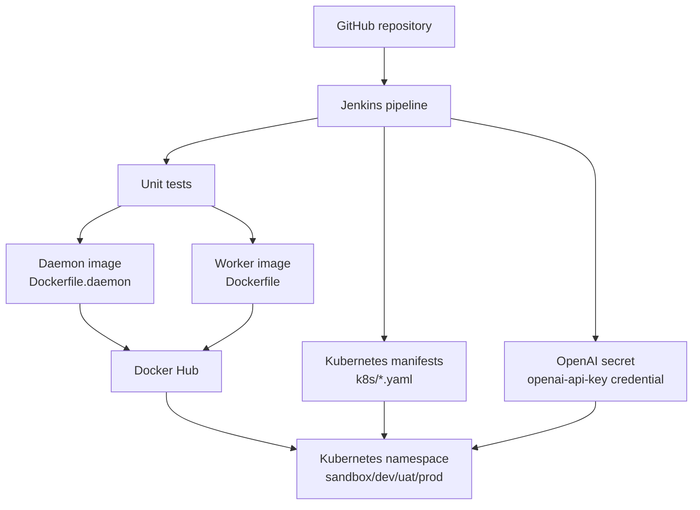

# SMS ChatGPT Architecture

## Runtime Flow

## Deployment Flow

## Key Runtime Notes

- The Android phone is physically attached to the host machine.
- In minikube, the pod connects to the host ADB server through `ADB_SERVER_SOCKET=tcp:host.minikube.internal:5037`.
- The daemon pod reads inbound SMS over ADB and opens the SMS composer for outbound replies unless a device-specific silent-send template is configured.
- Each sender maps to one Kubernetes chat pod, named from a sender hash.
- Conversation memory is stored inside that sender's chat pod and disappears when the pod is deleted after `CHAT_POD_IDLE_SECONDS`.
- The daemon needs RBAC permissions for pods and `pods/exec` so it can create chat pods and run the worker inside them.
